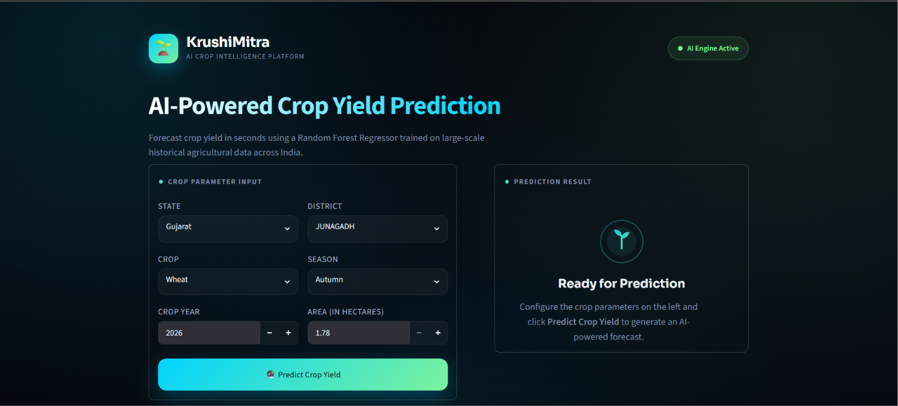
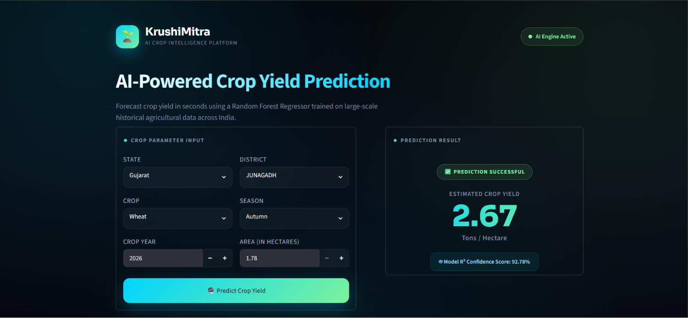
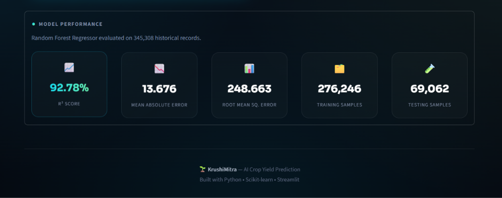

# 🌱 KrushiMitra – AI Crop Yield Prediction System

<p align="center">


</p>

---

## 📖 Project Overview

**KrushiMitra** is an AI-powered Crop Yield Prediction System developed using **Machine Learning** and **Streamlit**.

The application predicts crop yield based on agricultural parameters such as:

- 🌍 State
- 🏙 District
- 🌾 Crop
- 🌤 Season
- 📅 Crop Year
- 🌱 Area

The project demonstrates a complete end-to-end Machine Learning workflow including:

- Data Cleaning
- Exploratory Data Analysis (EDA)
- Feature Engineering
- Model Training
- Hyperparameter Tuning
- Model Evaluation
- Model Deployment using Streamlit

---

# ✨ Features

- 🤖 AI-powered Crop Yield Prediction
- 📊 Interactive Streamlit Dashboard
- 🌍 Dynamic State → District Selection
- 🌾 Crop & Season Selection
- 📈 Model Performance Dashboard
- 🧹 Data Cleaning & Preprocessing
- 📉 Exploratory Data Analysis (EDA)
- ⚙️ Hyperparameter Tuning
- 🚀 Production-ready ML Pipeline
- 🎨 Modern Responsive UI

---

# 🧠 Machine Learning Workflow

```
Raw Dataset
      │
      ▼
Data Cleaning
      │
      ▼
Exploratory Data Analysis
      │
      ▼
Feature Engineering
      │
      ▼
Preprocessing Pipeline
      │
      ▼
Model Training
      │
      ▼
Hyperparameter Tuning
      │
      ▼
Random Forest Regressor
      │
      ▼
Streamlit Deployment
```

---

# 📂 Dataset Information

The dataset contains agricultural information collected from different states and districts across India.

### Features

- State
- District
- Crop
- Crop Year
- Season
- Area

### Target Variable

- Yield

---

# 🤖 Machine Learning Models

The following regression models were trained and evaluated:

- Linear Regression
- Decision Tree Regressor
- Random Forest Regressor

### ✅ Final Selected Model

**Random Forest Regressor**

---

# 📊 Model Performance

| Metric | Value |
|---------|-------|
| Model | Random Forest Regressor |
| R² Score | **0.9278** |
| MAE | **13.676** |
| RMSE | **248.663** |
| Training Samples | **276,246** |
| Testing Samples | **69,062** |

---

# 🛠 Tech Stack

### Programming

- Python

### Data Analysis

- Pandas
- NumPy

### Visualization

- Matplotlib
- Seaborn

### Machine Learning

- Scikit-Learn
- Joblib

### Deployment

- Streamlit

---

# 📁 Project Structure

```text
KrushiMitra/
│
├── app/
│   └── app.py
│
├── backend/
│   ├── predictor.py
│   └── __init__.py
│
├── data/
│   ├── Crop_Yield.csv
│   ├── locations.py
│   └── __init__.py
│
├── models/
│   ├── model.pkl
│   └── preprocessor.pkl
│
├── notebooks/
│   └── Crop_Yield_Prediction_Model.ipynb
│
├── assets/
│
├── screenshots/
│
├── requirements.txt
├── README.md
└── .gitignore
```

---

# 🚀 Installation

Clone the repository

```bash
git clone https://github.com/deepkacha05/KrushiMitra-Crop-Yield-Prediction.git
```

Move into the project directory

```bash
cd KrushiMitra-Crop-Yield-Prediction
```

Install dependencies

```bash
pip install -r requirements.txt
```

Run the Streamlit application

```bash
streamlit run app/app.py
# 📸 Application Preview
# 📸 Application Preview

## 🏠 Home Page

<p align="center">
  
</p>

---

## 🌾 Prediction Result

<p align="center">
  
</p>

---

## 📊 Model Performance Dashboard

<p align="center">
  
</p>

# 📈 Future Improvements

- 🌦 Weather API Integration
- 🌱 Soil Health Analysis
- 🧪 Fertilizer Recommendation
- 🌾 Crop Recommendation System
- 🌐 Multi-language Support
- ☁ Cloud Deployment
- 📱 Mobile Responsive Dashboard

---

# 👨‍💻 Author

**Deep Kacha**

Computer Engineering Student

GitHub:
https://github.com/deepkacha05

Repository:
https://github.com/deepkacha05/KrushiMitra-Crop-Yield-Prediction

---

# ⭐ Support

If you found this project useful, consider giving it a ⭐ on GitHub.

It helps support the project and motivates future development.

---

## 📄 License

This project is licensed under the **MIT License**.